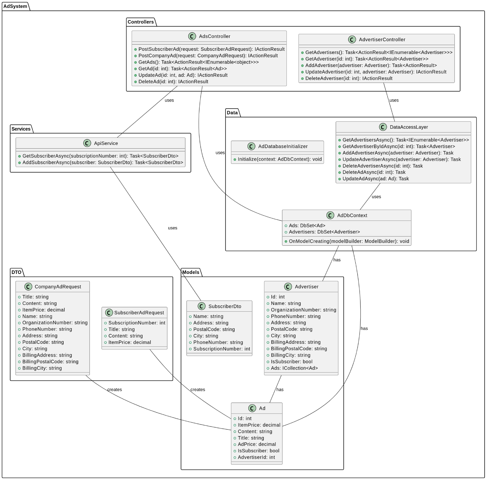
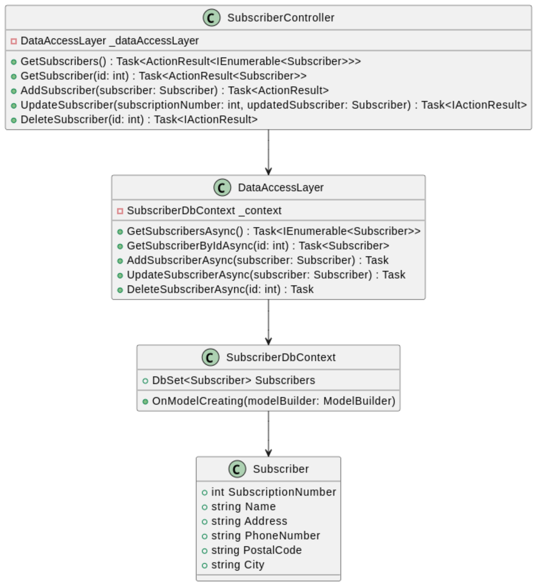

This application is designed to manage advertisements and advertisers, providing a seamless interface to handle both subscriber and company-based ads. The application includes both a backend API built with .NET Core and a frontend interface using React.

## Class Diagram, Adsystem

## Class Diagram, Subscriber System

## Features

    Advertiser Management: Create, read, update, and delete advertisers.
    Advertisement Handling: Add and manage advertisements with details such as title, content, and pricing.
    Subscriber Integration: Fetch and display subscriber information using subscription numbers.
    Error Handling: Graceful error messages for user feedback in case of missing or incorrect information.

## Prerequisites

    Backend
        .NET Core SDK
        Entity Framework Core
        A SQL Server or other database configured in appsettings.json

    Frontend
        Node.js
        npm (Node Package Manager)

Backend Setup

Configure Database
Create two separate databases, one for the adsystem and one for the subscriber system, i've been using Postgres.  

## Migrate Database

Run the following command to apply database migrations for both systems:

dotnet ef migrations add InitialCreate  
dotnet ef database update

## Run the Backend Server

Start the backend server using:

    Subscriber system
    dotnet run urls=http://localhost:5001

    Adsystem system
    dotnet run urls=http://localhost:5000

## Frontend Setup
    npm i
    npm start

Usage

    Fetch Subscriber: Use the frontend to enter a subscription number and fetch subscriber details.
    Manage Ads: Create and manage advertisements through the user interface.
    View Advertisers: View a list of current advertisers and their details.